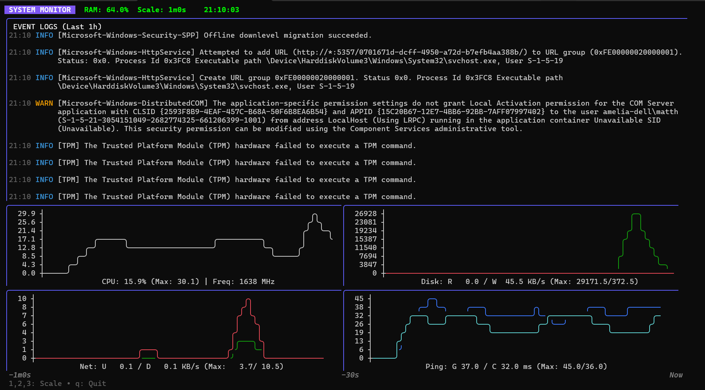

# Windows Monitor TUI

A real-time, terminal-based system monitor for Windows, built with Go. It provides a comprehensive view of system performance metrics and integrates Windows Event Logs into a single, cohesive dashboard.



## Features

- **Real-time Performance Graphs**:
  - **CPU Usage**: Visualizes CPU load and tracks frequency (MHz).
  - **Disk I/O**: Tracks Read and Write speeds in KB/s.
  - **Network Traffic**: Monitors Upload and Download speeds.
  - **Latency**: Measures ping response times to Google (8.8.8.8) and Cloudflare (1.1.1.1).
- **Integrated Windows Event Logs**: Fetches and displays Error and Warning events from Application, System, Setup, and security-related logs (AppLocker, CodeIntegrity).
- **Configurable Time Scales**: Switch between 1-minute, 5-minute, and 15-minute views.
- **JSON Logging**: Automatically logs metrics and Windows events to `monitor.log` for later analysis.
- **Interactive UI**: Built with [Bubble Tea](https://github.com/charmbracelet/bubbletea) and [Lip Gloss](https://github.com/charmbracelet/lipgloss).

## Prerequisites

- **Windows OS** (Uses PowerShell and Windows-specific APIs)
- **Go 1.26+** (For building from source)
- **Task** (Optional, for using the provided Taskfile)

## Getting Started

### Installation

1. Clone the repository:
   ```bash
   git clone https://github.com/yourusername/windows-monitor-tui.git
   cd windows-monitor-tui
   ```

2. Build the project:
   ```bash
   task build
   ```
   *Note: This will build and attempt to sign the binary using the included `sign.ps1` script.*

### Usage

Run the monitor using:
```bash
task run
```
Or directly:
```bash
go run .
```

### Keybindings

- `1`: Set graph scale to **1 minute**.
- `2`: Set graph scale to **5 minutes**.
- `3`: Set graph scale to **15 minutes**.
- `q` or `Ctrl+C`: Quit the application.

## Development

The project uses a `Taskfile.yml` for common development operations:

- `task trust`: Trust the development certificate (requires Administrator privileges).
- `task sign`: Manually sign the built binary.
- `task clean`: Remove the `monitor.exe` binary.

## License

[MIT License](LICENSE) (or your preferred license)
